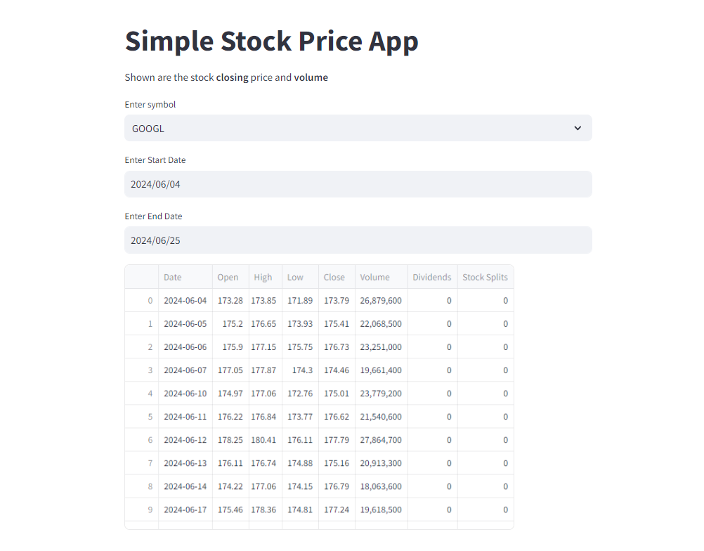
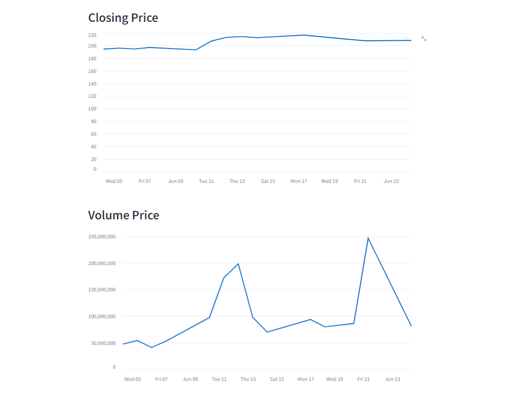

# Simple Stock Price App




This is a simple stock price application built with Streamlit and Docker. The app allows users to select a stock ticker symbol, enter a date range, and view the stock's closing price and volume over that period.

## Features

- Display stock closing prices and volume.
- Select stock ticker symbols from a predefined list.
- Choose start and end dates for historical data.

## Technologies Used

- Python
- Streamlit
- yfinance
- pandas
- Docker

## Getting Started

### Prerequisites

- Docker installed on your machine.

### Installation

1. Clone the repository:

```bash
git clone https://github.com/your-username/simple-stock-price-app.git
cd simple-stock-price-app
```

2. Create a tickers.csv file in the root directory with the stock symbols you want to include. For example:

```bash
AAPL
GOOGL
MSFT
```

3. Create a requirements.txt file with the following dependencies:

```bash
streamlit
yfinance
pandas
```
### Running the App

1. Build the Docker image:

```bash
docker build -t simple-stock-price-app .
```

2. Run the Docker container:

```bash
docker run -p 8501:8501 simple-stock-price-app
```

3. Open your web browser and navigate to http://localhost:8501 to use the app.

### Usage

1. Select a stock ticker symbol from the dropdown menu.
2. Enter the start and end dates for the period you want to analyze.
3. View the closing price and volume charts.
   
### Project Structure

```bash
.
├── app
│   ├── main.py
│   ├── tickers.csv
│   └── requirements.txt
├── Dockerfile
└── README.md
```

* app/main.py: Main Streamlit application code.
* app/tickers.csv: CSV file containing stock ticker symbols.
* app/requirements.txt: Python dependencies.
* Dockerfile: Instructions to build the Docker image.
* README.md: This file.

### Contributing

Contributions are welcome! If you'd like to contribute to this project, please fork the repository and submit a pull request with your changes.

### License

This project is licensed under the MIT License. See LICENSE for details.

### Acknowledgments

Simple Project help you to start with streamlit.

I hope this helps! Let me know if you have any questions or need further assistance.
